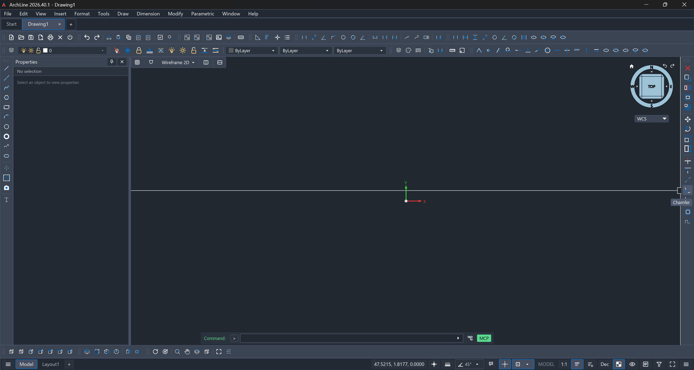

<p align="center">
  
</p>

<h1 align="center">ArchLine</h1>

<p align="center">
  CAD 2D/3D open source per lo studio di architettura, con un workspace in stile "AutoCAD classico".<br>
  Scritto in Rust. Legge e scrive DWG e DXF in modo nativo.
</p>

<p align="center">
  <a href="LICENSE"></a>
</p>

<p align="center">
  
</p>

## Cos'è

ArchLine è un fork di [Open CAD Studio](https://github.com/HakanSeven12/OpenCADStudio) (Rust, interfaccia [iced](https://iced.rs), rendering `wgpu`) pensato per chi disegna ogni giorno in AutoCAD e vuole un'alternativa libera, con gli stessi riferimenti: barre degli strumenti docked, riga di comando, palette, layer sempre a portata di mano.

Il progetto ha due obiettivi:

1. **Workspace "AutoCAD classico"** — barre Draw e Modify agganciate ai lati, barra dei menu, riga di comando, barra dei layer, pagina iniziale con i file recenti.
2. **Strato architettonico come plugin** *(da fare)* — locali, abachi, IFC e quantità, con la fonte di ogni dato e il suo stato.

> **Stato: sviluppo attivo, non ancora per la produzione.** Tieni sempre una copia dei disegni importanti e non sovrascrivere i file originali. Le segnalazioni riproducibili sono benvenute nelle [Issues](https://github.com/Ilmazza/ArchLine/issues).

## Cosa c'è di diverso da Open CAD Studio

| Area | In ArchLine |
| --- | --- |
| **Workspace** | Modalità classica di default: barre Draw (sinistra) e Modify (destra), barra Layers, barre dai menu (Dimension, Insert, Inquiry…), barre sganciabili e con elenco di visibilità (tasto destro). Un pulsante per comando; pressione prolungata sui sottomenu per i flyout con le varianti. Il ribbon resta disponibile con `ARCHLINE_WORKSPACE=ribbon`. |
| **Barra Layers** | Gestione layer, menu layer, i comandi layer del ribbon (compresi `LAYCUR` e `LAYERP`), menu Colore / Tipo linea / Spessore; segue l'oggetto selezionato come in AutoCAD. |
| **Pagina iniziale** | In stile AutoCAD: barra laterale, file recenti a schede con ordinamento, ricerca e vista griglia/elenco. |
| **Offline di default** | Nessuna richiesta di rete all'avvio (aggiornamenti, Discussions, video, Patreon). Si riattiva con `ARCHLINE_ONLINE=1`. |
| **Interfaccia ripulita** | Niente inviti a donazioni, sponsor e social nella schermata principale (`ARCHLINE_PROMO=1` li riporta). |
| **Marchio** | Nome, logo e logotipo ArchLine. |
| **Immagini** | `XREF Reload`, la palette e `Reload All` ricaricano anche le immagini. |
| **Banco di conformità DXF/DWG** | Misura la fedeltà di lettura/scrittura del codec con [ezdxf](https://ezdxf.mozman.at) come oracolo indipendente (vedi sotto). |

I nuclei più specifici del fork sono concentrati, quando possibile, in file separati, per tenere piccoli i conflitti quando si riallinea con upstream: `src/privacy.rs`, `src/workspace.rs`, `src/ui/classic_*.rs`, `src/ui/wordmark.rs`, `tests/conformance/`. Altre modifiche toccano file condivisi con upstream (ad esempio in `src/app/`, `src/scene/`, `src/command.rs`). Le istruzioni per chi lavora sul codice sono in [CLAUDE.md](CLAUDE.md).

## Verso lo strato architettonico

Il plugin architettonico non c'è ancora. L'idea di partenza:

- **Locali e abachi** a partire dal disegno, con superfici e perimetri ricavati dalla geometria.
- **IFC** in lettura e scrittura.
- **Quantità con fonte e stato**: ogni numero dichiara da dove viene. Un dato deterministico (da IFC o DXF) è tenuto distinto da un dato desunto da raster o PDF, che resta una *bozza da verificare*. Nessun valore viene inventato.
- Gestione esplicita del tipo di intervento (nuova costruzione, ristrutturazione, manutenzione, restauro), perché cambia le regole del computo.

Le specifiche di progetto sono in [docs/superpowers/specs/](docs/superpowers/specs/); l'analisi di cosa manca rispetto ad AutoCAD è in [docs/gap-ocs-vs-autocad.md](docs/gap-ocs-vs-autocad.md).

## Formati supportati

| Formato | Supporto |
| --- | --- |
| DWG | Lettura e scrittura; versioni di salvataggio da R14 a 2018 |
| DXF | Lettura e scrittura; versioni di salvataggio da R14 a 2018 |
| BAK / SV$ | Apertura di backup e salvataggi automatici |
| OBJ | Importazione di mesh poligonali |
| LandXML | Importazione dei punti `CgPoint` |
| STL | Esportazione mesh 3D |
| STEP AP203 | Esportazione mesh 3D |
| PDF | Stampa di layout e geometrie selezionate (desktop) |
| CSV | Estrazione delle proprietà degli oggetti |
| CTB / STB | Caricamento e modifica degli stili di stampa |

Dal motore di Open CAD Studio eredita anche disegno 2D di precisione (polilinee, spline, retini, snap, blocchi, riferimenti esterni), quotatura e spazio carta con viewport, modellazione solida 3D (estrusione, rivoluzione, sweep, loft, booleane) e 21 lingue di interfaccia, italiano compreso.

## Installazione

Non ci sono ancora release ufficiali di ArchLine. Le strade possibili sono due.

### Windows — build della CI

A ogni push su `lavoro` o su un branch `claude/**` il workflow [archline-windows.yml](.github/workflows/archline-windows.yml) compila su `windows-latest` e pubblica l'artefatto `ArchLine-windows-N`: **Actions → corsa → Artifacts**. Contiene l'eseguibile e il rapporto del banco di conformità.

### Dal sorgente

Requisiti: Git, toolchain Rust stabile, librerie grafiche e font della piattaforma. Su Ubuntu/Debian:

```bash
sudo apt update
sudo apt install libgl1-mesa-dev libx11-dev libxcursor-dev libxi-dev \
  libxrandr-dev libxkbcommon-dev libwayland-dev libfontconfig1-dev \
  libfreetype6-dev
```

Poi:

```bash
git clone https://github.com/Ilmazza/ArchLine.git
cd ArchLine
cargo build --release --bin OpenCADStudio
```

L'eseguibile è `target/release/OpenCADStudio` (`OpenCADStudio.exe` su Windows). Il nome del binario e del package Cargo resta quello di upstream di proposito, per non rompere il merge periodico.

> Non rimuovere `RUST_MIN_STACK` da [.cargo/config.toml](.cargo/config.toml) (64 MiB): senza, `rustc` va in stack overflow su Windows in release.

## Variabili d'ambiente

| Variabile | Effetto |
| --- | --- |
| `ARCHLINE_ONLINE=1` | Riattiva aggiornamenti, Discussions, video e Patreon |
| `ARCHLINE_PROMO=1` | Riporta Donate, Sponsors, Reddit, Patreon, OCS Web, Send Feedback |
| `ARCHLINE_WORKSPACE=ribbon` | Ripristina il ribbon al posto del workspace classico |

## Test

```bash
cargo check --locked
cargo test --locked --lib classic_toolbar     # altri filtri: start, i18n
```

### Banco di conformità DXF/DWG

Misura `OpenCADStudio --export` su 9 casi sintetici × R2000/R2018 × DXF→DXF e DXF→DWG→DXF, confrontando il risultato con [ezdxf](https://ezdxf.mozman.at), che fa da oracolo indipendente. Le divergenze note sono registrate (con nota) in `tests/conformance/expected.json`.

```bash
python -m pip install ezdxf
python -m unittest discover -s tests/conformance -p "test_*.py"
python tests/conformance/run.py target/release/OpenCADStudio.exe
```

Limiti dichiarati: ezdxf non legge DWG, quindi il DWG è verificato solo in modo indiretto; i casi sono disegni sintetici; il caso `colors` viene eseguito ma nessun controllo ne verifica ancora colori e layer. Uso e dettagli in [tests/conformance/README.md](tests/conformance/README.md).

## Automazione

Il binario desktop eredita da upstream l'esportazione da riga di comando, un server headless e un endpoint MCP:

```bash
OpenCADStudio --export input.dwg output.dxf
OpenCADStudio --export input-r12.dxf output.dwg --target-version R14
OpenCADStudio --serve
OpenCADStudio --mcp
```

Dettagli nella [guida all'automazione](docs/automation/README.md). I plugin nativi girano in processi separati: vedi [architettura dei plugin](docs/plugin-architecture.md).

## Sviluppo e contributi

- Il lavoro quotidiano avviene sul branch `lavoro`; il lavoro assistito va su branch `claude/…` e si unisce con pull request.
- `main` è riservato al riallineamento con upstream (`HakanSeven12/OpenCADStudio`) e non ospita il lavoro del fork; non si tocca senza conferma.
- Segnalazioni e proposte: [Issues](https://github.com/Ilmazza/ArchLine/issues). Vulnerabilità: [SECURITY.md](SECURITY.md).

## Crediti e licenza

ArchLine nasce da [Open CAD Studio](https://github.com/HakanSeven12/OpenCADStudio) di Hakan Seven e dei suoi collaboratori, a cui va il merito del motore, del codec DWG/DXF e della maggior parte delle funzioni. Se ti serve il progetto originale, con le sue release multipiattaforma e la versione web, vai lì.

L'applicazione è distribuita con licenza [GNU GPL v3.0](LICENSE); il codec DWG/DXF è sotto licenza MPL-2.0. "ArchLine" è il nome di lavoro di questo fork. Esiste già un prodotto con un nome molto vicino, [ARCHLine.XP](https://www.archlinexp.com/) (CAD/BIM di CADLINE), la cui documentazione lo dichiara marchio registrato: il nome pubblico è da verificare prima di una diffusione più ampia.
